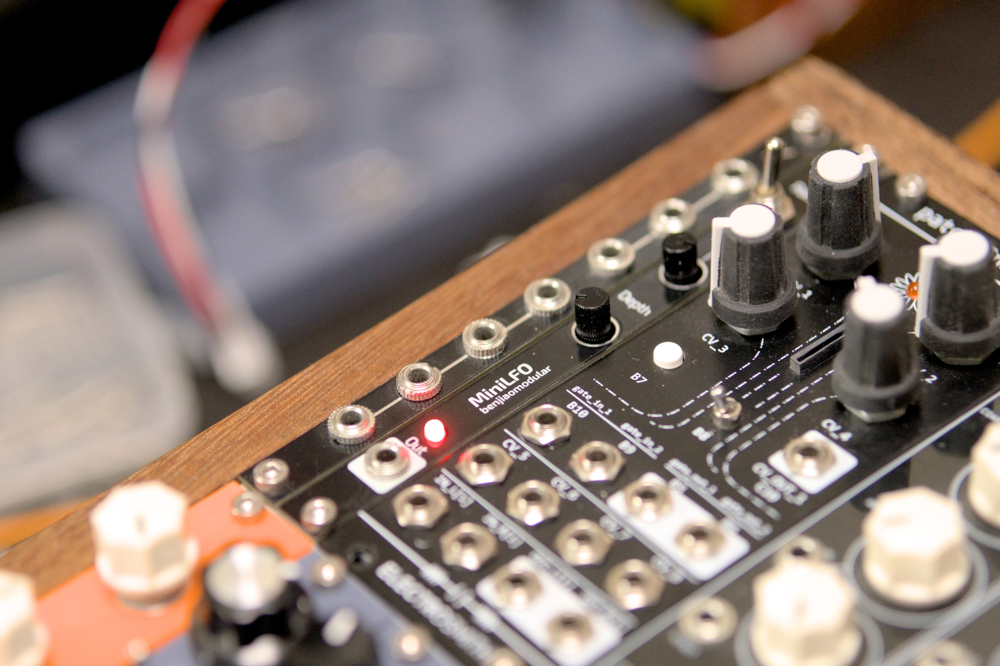

# MiniLFO

A super simple 2HP triangle wave LFO for Eurorack modular synth. This is roughly based on [David Haillant's Simple LFO](https://www.davidhaillant.com/wp/wp-content/uploads/lfo-1.5b-20210205.pdf).

More info on my website: https://benjiaomodular.com/posts/minilfo

